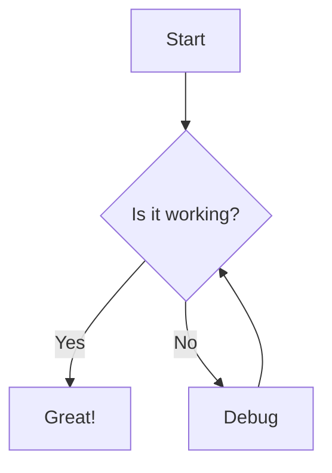

# md2pdf - Markdown to PDF Converter

A comprehensive TypeScript-based tool that converts Markdown files to PDF with full support for:
- ✅ **Mermaid diagrams** - Flowcharts, sequence diagrams, and more
- ✅ **Math equations** - Inline and block equations using KaTeX
- ✅ **Syntax highlighting** - 190+ programming languages via highlight.js
- ✅ **Custom themes** - 10 built-in professional themes
- ✅ **GitHub-Flavored Markdown** - Tables, task lists, footnotes, and more
- ✅ **CLI and Library** - Use as a command-line tool or import as a module

## Features

### Markdown Support
- **Basic**: Headings, lists, bold, italic, links, images
- **Extended**: Tables, task lists, footnotes, strikethrough
- **GFM**: Syntax highlighting for code blocks
- **Advanced**: Mermaid diagrams, math equations (KaTeX)

### Themes
10 professionally designed themes:
- `default` - Clean, professional styling
- `github` - GitHub-style documentation
- `academic` - Academic paper formatting
- `minimal` - Minimalist design
- `dark` - Dark mode theme
- `corporate` - Corporate/business style
- `ibm` - IBM Design Language inspired
- `technical-report` - Technical documentation
- `book` - Book-style formatting
- `executive-report` - Executive summary style

### PDF Options
- Multiple page sizes (A4, A3, A5, Letter, Legal, Tabloid)
- Portrait or landscape orientation
- Custom margins
- Headers and footers
- Table of contents generation
- PDF metadata (title, author, subject, keywords)

## Installation

```bash
cd src/md2pdf
npm install
npm run build
```

## Usage

### Command Line

```bash
# Basic usage
md2pdf input.md output.pdf

# With theme
md2pdf input.md output.pdf --theme github

# With options
md2pdf input.md output.pdf --theme academic --page-size A4 --orientation portrait

# Multiple files
md2pdf *.md --output-dir ./pdfs

# With configuration file
md2pdf input.md --config md2pdf.config.json
```

### Library API

```typescript
import { convertMarkdownToPDF, MarkdownConverter } from 'md2pdf';

// Simple conversion
await convertMarkdownToPDF('input.md', 'output.pdf');

// With options
await convertMarkdownToPDF('input.md', 'output.pdf', {
  theme: 'github',
  pageSize: 'A4',
  enableMermaid: true,
  enableMath: true,
  enableSyntaxHighlight: true,
});

// Advanced usage
const converter = new MarkdownConverter({
  theme: 'corporate',
  pageSize: 'Letter',
  margins: '25mm',
});

const result = await converter.convert('input.md', 'output.pdf');
console.log('PDF generated:', result.outputPath);
```

## Configuration

### Options

```typescript
interface ConversionOptions {
  // Page settings
  pageSize?: 'A4' | 'A3' | 'A5' | 'Letter' | 'Legal' | 'Tabloid';
  orientation?: 'portrait' | 'landscape';
  margins?: string | { top: string; right: string; bottom: string; left: string };
  
  // Styling
  theme?: string;
  themeCustomization?: {
    colors?: { primary?: string; secondary?: string; /* ... */ };
    fonts?: { body?: string; heading?: string; code?: string };
    spacing?: { paragraphSpacing?: string; /* ... */ };
    customCSS?: string;
  };
  
  // Features
  enableMermaid?: boolean;
  enableMath?: boolean;
  enableSyntaxHighlight?: boolean;
  enableTableOfContents?: boolean;
  
  // Output
  displayHeaderFooter?: boolean;
  headerTemplate?: string;
  footerTemplate?: string;
  
  // PDF metadata
  title?: string;
  author?: string;
  subject?: string;
  keywords?: string;
}
```

### Configuration File

Create a `md2pdf.config.json`:

```json
{
  "theme": "github",
  "pageSize": "A4",
  "orientation": "portrait",
  "margins": "20mm",
  "enableMermaid": true,
  "enableMath": true,
  "enableSyntaxHighlight": true,
  "themeCustomization": {
    "colors": {
      "primary": "#0366d6",
      "heading": "#24292e"
    },
    "fonts": {
      "body": "Georgia, serif"
    }
  }
}
```

## Examples

### Mermaid Diagrams

````markdown

````

### Math Equations

```markdown
Inline math: $E = mc^2$

Block math:
$$
\int_{-\infty}^{\infty} e^{-x^2} dx = \sqrt{\pi}
$$
```

### Code with Syntax Highlighting

````markdown
```typescript
function greet(name: string): string {
  return `Hello, ${name}!`;
}
```
````

## Project Structure

```
src/md2pdf/
├── src/
│   ├── index.ts              # Main library export
│   ├── cli.ts                # CLI entry point
│   ├── converter.ts          # Core conversion logic
│   ├── parser.ts             # Markdown parsing
│   ├── renderer.ts           # HTML generation
│   ├── pdf-generator.ts      # Puppeteer PDF creation
│   ├── processors/
│   │   ├── mermaid.ts        # Mermaid diagram processor
│   │   ├── math.ts           # KaTeX math processor
│   │   └── code.ts           # Syntax highlighting
│   ├── styles/
│   │   └── themes/           # Built-in themes
│   ├── types/
│   │   └── index.ts          # TypeScript type definitions
│   └── utils/
│       ├── config.ts         # Configuration handling
│       ├── errors.ts         # Error classes
│       └── validators.ts     # Input validation
├── tests/                    # Test files
├── examples/                 # Example markdown files
├── package.json
├── tsconfig.json
└── README.md
```

## Development

```bash
# Install dependencies
npm install

# Build
npm run build

# Run in development mode
npm run dev

# Run tests
npm test

# Lint
npm run lint

# Format code
npm run format
```

## Requirements

- Node.js >= 16.0.0
- TypeScript >= 5.0.0

## Dependencies

- **markdown-it**: Markdown parser
- **puppeteer**: Headless Chrome for PDF generation
- **highlight.js**: Syntax highlighting
- **mermaid**: Diagram rendering
- **katex**: Math equation rendering
- **commander**: CLI argument parsing
- **chalk**: Terminal output styling

## License

MIT

## Contributing

Contributions are welcome! Please feel free to submit a Pull Request.

## Roadmap

- [x] Basic markdown to PDF conversion
- [x] Mermaid diagram support
- [x] Math equation support (KaTeX)
- [x] Syntax highlighting
- [x] Multiple themes
- [ ] Custom theme creator
- [ ] Table of contents generation
- [ ] Batch conversion
- [ ] Watch mode
- [ ] Web UI
- [ ] Docker image

## Support

For issues, questions, or contributions, please visit the project repository.